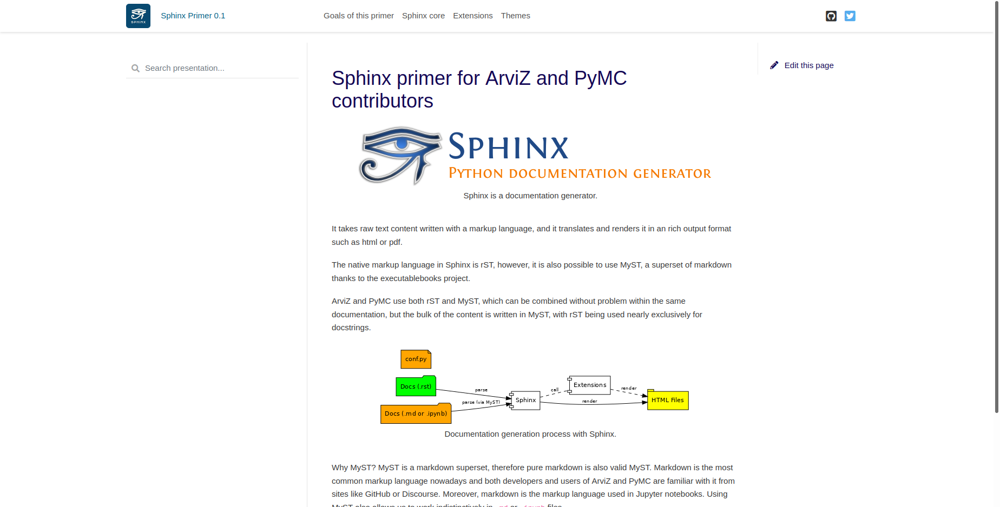

# Themes

Sphinx supports multiple themes so that one can easily change the appearance of
the documentation without changing the content. A single line change can
modify completely the appearance of the documentation without requiring
any change in the render process nor infrastructure.

Here is one example. Changing only a single line, the one that sets the
`html_theme` variable in `conf.py` the webpage rendered when running
`sphinx-build` changes completely.

:::::{grid} 1 1 2 2

::::{grid-item}
:::{figure-md} pst-theme

Screenshot of this primer using the [pydata sphinx theme](https://pydata-sphinx-theme.readthedocs.io/en/latest/)
:::
::::

::::{grid-item}
:::{figure-md} sbt-theme

Screenshot of this primer using the [sphinx book theme](https://sphinx-book-theme.readthedocs.io/en/latest/)
:::
::::
:::::

{numref}`pst-theme` is a screenshot of the website you are seeing, that sets
`html_theme = "pydata_sphinx_theme"`. {numref}`sbt-theme` is a screenshot
of the website generated by sphinx with the same content when using
`html_theme = "sphinx_book_theme"`.

Both ArviZ and PyMC use the [pydata sphinx theme](https://pydata-sphinx-theme.readthedocs.io/en/latest/)
which is extremely customizable even via variables in the `conf.py` alone.
